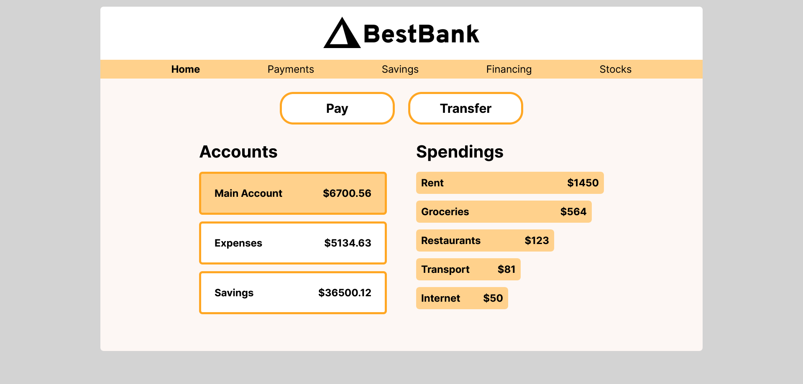

 ## Table of contents

- [Overview](#overview)
  - [The challenge](#the-challenge)
  - [Screenshot](#screenshot)
  - [Links](#links)
- [My process](#my-process)
  - [Built with](#built-with)
  - [What I learned](#what-i-learned)
  - [Continued development](#continued-development)
  - [Useful resources](#useful-resources)
- [Author](#author)
- [Acknowledgments](#acknowledgments)


### Overview

Scrimba M4 bootcamp project: Best Bank
[Scrim](https://scrimba.com/scrim/cocf84a259acc922196ded766)


### The challenge

Requirements:
- build it from scratch
- follow the design
[Figma design](https://www.figma.com/file/5OS7V37a4fo3WIDLL7YisW/BestBank-(Copy)?node-id=0-1&t=YMvZxkwdgvRu8CfE-0)
- make sure you use
   - semantic HTML
   - hover
      - select account - orange background
      - button hover - orange
      - menu hover - underline
   - container
   - group selectors
   - compound selectors

Stretch goals:
- add column with spending bars
- animated hover effect to buttons
- fetch data from JS
- click on account to change view 
  - account turns orange
  - display spending from each account

Personal stretch goal: 
- responsiveness  


 ### Screenshot
 
 

### Links

- [Scrim](https://scrimba.com/scrim/cocba4ac08b3c963968d84a7b)
- [Github](https://github.com/casserole27/bestbank)
- [Live Site](https://www.clewisdev.com/bestbank/)

## My process

- Create Github repository
- Set up basic HTML file 
- Set up basic CSS file
- Set up basic JavaScript file
- Consult Figma design files
- Project work
- Publish live URL
- Check markup and accessibility
(https://validator.w3.org/)
(https://wave.webaim.org/)
- README file

### Built with

- semantic HTML5
- CSS custom properties
- CSS hover and animated effect
- Responsive Web Design
- vanilla JavaScript

### What I learned

- More rendering lists: this was very similar to the Oldagram and Choreslist projects that I just completed. 
- It is a matter of figuring out the correct logic depending on what the project is asking you to do with the list.
- In this case, I rendered two lists using template literals so that I could insert the data from the accounts array, but then had to figure out how to uniquely identify list items so that the selected account is highlighted by the orange background color. This did not seem possible with toggling classes, do I applied the .style.backgroundColor to the elements.
- I used .querySelectorAll to make sure all the elements background were changed to white, and then used "e.target" to change the clicked item to and orange background.
- I used event delegation on the ul defined by "accountsList".

```javascript
accountsList.addEventListener("click", function(e) {
    
    if (e.target.tagName === "LI") {
    
        const listItems = document.querySelectorAll(".list")
        listItems.forEach(function (listItem) {
        listItem.style.backgroundColor = "#FFFFFF";
        });

        const clickedListItem = e.target;
        clickedListItem.style.backgroundColor = "#FFD18C";
    };    


    const target = e.target.dataset.account;
    if (target) {
        renderSpendings(target);
    };
    
});
```

### Continued development

- Since many of these projects have dealt with clickable li elements, I wonder if they should be buttons instead.


### Useful resources

[Scrimba help](https://scrimba.com/scrim/cmZ86WCa)


## Author

- Website - [C Lewis](https://www.clewisdev.com)
- LinkedIn - [LinkedIn](https://www.linkedin.com/in/clewisdev/)


## Acknowledgments


